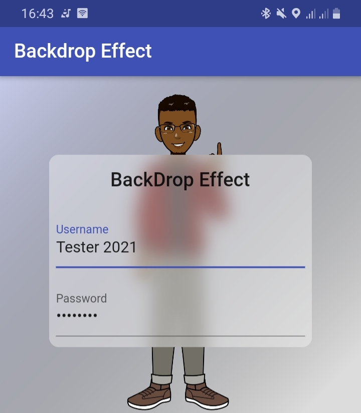
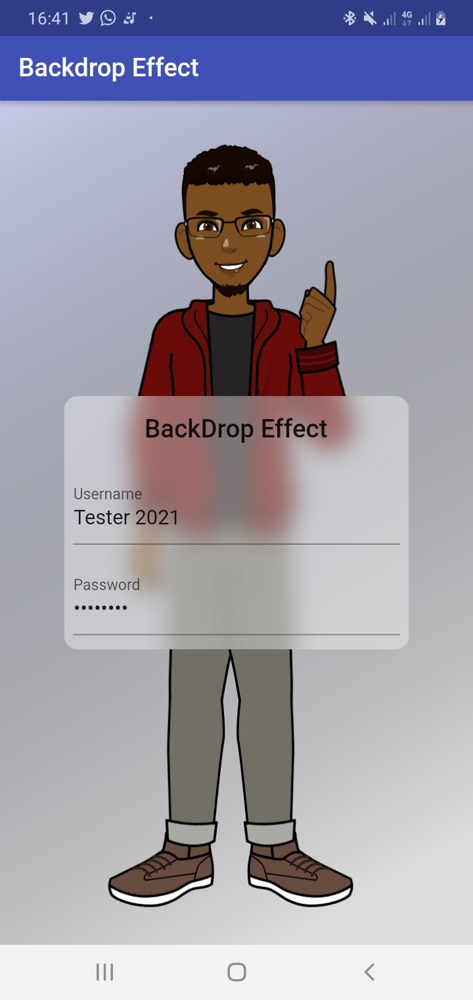

# Backdrop

## To know how

    - clone project
    - flutter run
    - Check out first_screen.dart!

## Screenshots

### Visit official documentation

- [Flutter](https://api.flutter.dev/flutter/widgets/BackdropFilter-class.html)

### Check out this StackOverFlow post

- [Frosted glass example](https://stackoverflow.com/questions/43550853/how-do-i-do-the-frosted-glass-effect-in-flutter)

### Follow me on

- Twitter: [Delé](https://twitter.com/_Akindele_Mike)
- Github: [DeleMike](https://github.com/DeleMike)
